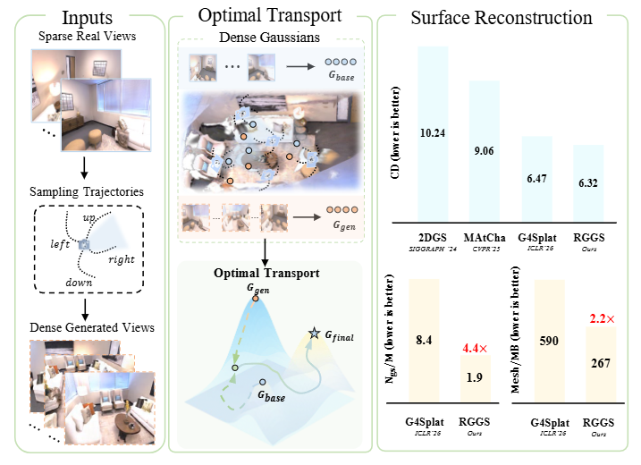
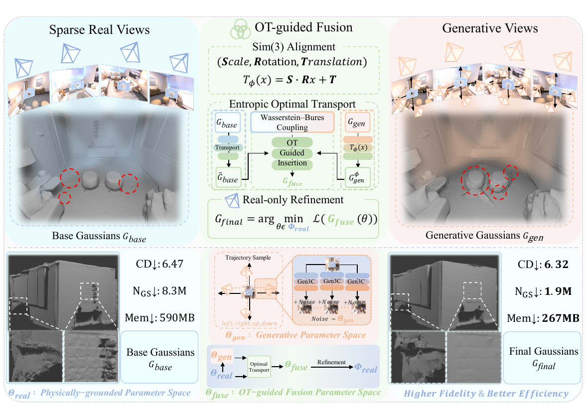
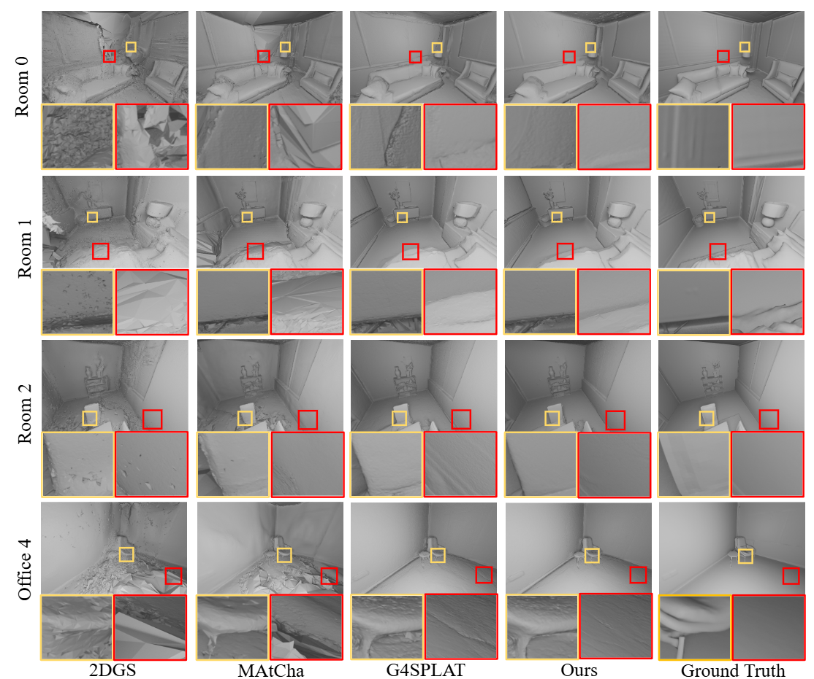
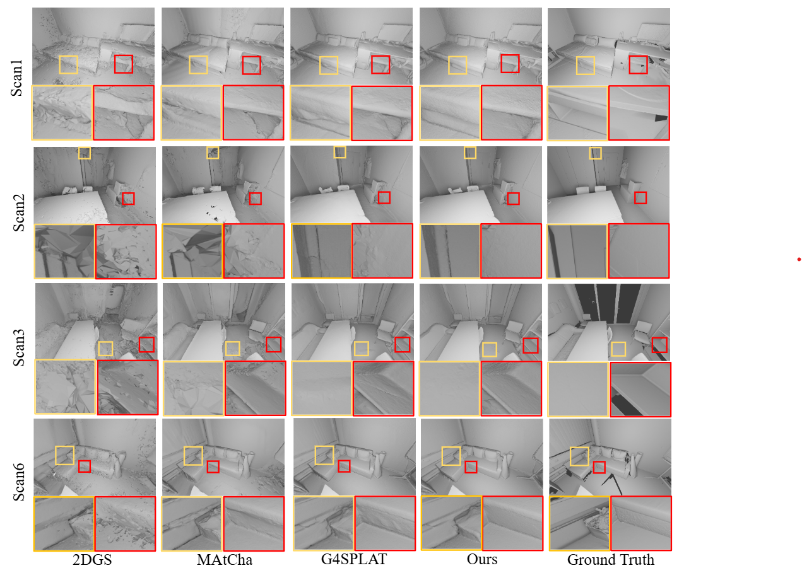
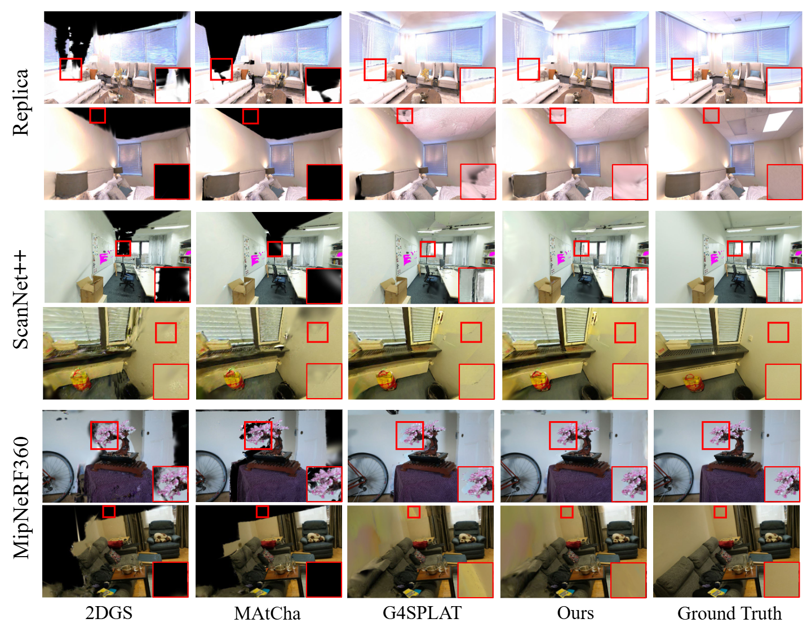
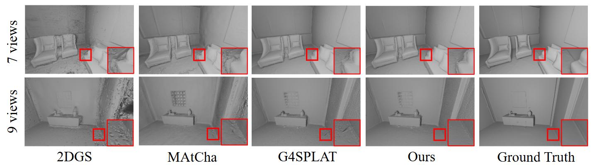

<h2 align="center" style="font-size:24px;">
  <b>RGGS: Re-grounded Sparse-View 3D Gaussian Surface Reconstruction via Generative Priors and Optimal Transport</b>
</h2>

<p align="center">
  Research code and reproduction notes for the RGGS pipeline.
</p>

<p align="center">
  
</p>

RGGS targets sparse-view 3D Gaussian surface reconstruction. The core idea is to optimize a base Gaussian field from real sparse views, build a generative Gaussian field from synthesized views, align and fuse them in model space with optimal transport, and finally perform a real-only re-grounding refinement step to recover physically consistent geometry.

## Pipeline Overview

<p align="center">
  
</p>

The practical reproduction pipeline in this repository is:

1. Prepare the base sparse-view reconstruction and the generated-view reconstruction.
2. Merge the two Gaussian fields with `mw2_merge.sh`.
3. Re-ground the merged field with `train_reinforce.py` or `train_reinforce_2.py`.
4. Extract meshes and evaluate with `2d-gaussian-splatting/eval/eval.py`.

## Installation

### 1. Clone the repository

```bash
git clone https://github.com/EleZou/RGGS.git --recursive
cd RGGS
```

If you already have the code locally, make sure the submodules are initialized:

```bash
git submodule update --init --recursive
```

### 2. Create the environment

We conduct our experiments on an NVIDIA A800 80G GPU. This codebase is developed around Python 3.9, PyTorch 2.0.1, and CUDA 11.8 on Linux. A Conda environment is recommended.

```bash
conda create -n rggs python=3.9 -y
conda activate rggs
```

Install system packages first:

```bash
conda install -y cmake gmp cgal -c conda-forge
```

Install PyTorch and common Python dependencies:

```bash
pip install torch==2.0.1 torchvision==0.15.2 torchaudio==2.0.2 --index-url https://download.pytorch.org/whl/cu118
pip install -r requirements.txt
```

Install additional research dependencies used by the full pipeline:

```bash
pip install "git+https://github.com/facebookresearch/pytorch3d.git@stable"
pip install "git+https://github.com/facebookresearch/segment-anything.git"
pip install "git+https://github.com/facebookresearch/detectron2.git"
```

### 3. Build 2D Gaussian Splatting related extensions

```bash
cd 2d-gaussian-splatting/submodules/diff-surfel-rasterization
pip install -e .

cd ../simple-knn
pip install -e .

cd ../tetra-triangulation
cmake .

# Adjust the CUDA path if your CUDA installation is elsewhere.
export CPATH=/usr/local/cuda-11.8/targets/x86_64-linux/include:$CPATH
export LD_LIBRARY_PATH=/usr/local/cuda-11.8/targets/x86_64-linux/lib:$LD_LIBRARY_PATH
export PATH=/usr/local/cuda-11.8/bin:$PATH

make
pip install -e .
cd ../../../
```

### 4. Build MASt3R / DUSt3R related modules

```bash
cd mast3r/asmk/cython
cythonize *.pyx

cd ..
pip install .

cd ../dust3r/croco/models/curope/
python setup.py build_ext --inplace
cd ../../../../../
```

### 5. Download checkpoints

#### 5.1 Depth Anything V2

```bash
mkdir -p ./Depth-Anything-V2/checkpoints/
wget https://huggingface.co/depth-anything/Depth-Anything-V2-Large/resolve/main/depth_anything_v2_vitl.pth -P ./Depth-Anything-V2/checkpoints/
```

#### 5.2 MASt3R checkpoints

```bash
mkdir -p ./mast3r/checkpoints/
wget https://download.europe.naverlabs.com/ComputerVision/MASt3R/MASt3R_ViTLarge_BaseDecoder_512_catmlpdpt_metric.pth -P ./mast3r/checkpoints/
wget https://download.europe.naverlabs.com/ComputerVision/MASt3R/MASt3R_ViTLarge_BaseDecoder_512_catmlpdpt_metric_retrieval_trainingfree.pth -P ./mast3r/checkpoints/
wget https://download.europe.naverlabs.com/ComputerVision/MASt3R/MASt3R_ViTLarge_BaseDecoder_512_catmlpdpt_metric_retrieval_codebook.pkl -P ./mast3r/checkpoints/
```

#### 5.3 SAM checkpoint

```bash
mkdir -p ./checkpoint/segment-anything/
wget https://dl.fbaipublicfiles.com/segment_anything/sam_vit_h_4b8939.pth -P ./checkpoint/segment-anything/
```

#### 5.4 See3D checkpoint

Please download the See3D weights separately and place them here:

```bash
mkdir -p ./checkpoint/
mv YOUR_LOCAL_PATH/MVD_weights ./checkpoint/MVD_weights
```

## Data Preparation

Please download the preprocessed data from HuggingFace and unzip it into the `data` folder:

`https://huggingface.co/datasets/JunfengNi/G4Splat`

The resulting folder structure should be:

```text
RGGS
|-- data
|   |-- replica
|   |   |-- scan ...
|   |-- scannetpp
|   |   |-- scan ...
|   |-- deepblending
|   |   |-- scan ...
|   `-- denseview
|       `-- scan1
```

For our RGGS reproduction setting, we additionally provide:

- the `Replica` dataset `scan1`
- the preprocessed 5-view generated results (`5views_gen`) for `Replica/scan1`:
  `https://pan.quark.cn/s/08afbc0e97a4`
- the base Gaussian field used for reinforcement / re-grounding

This is the recommended entry point for reproducing the `Replica/scan1` results in this repository.

If you need the detailed procedure for generating the auxiliary Gaussian field in advance, please contact Jianan Zou at `aujazou@mail.scut.edu.cn`. We will provide help for reproducing the full generation pipeline.

## Base Training

If you want to run the full sparse-view training pipeline from raw input images, you can start from:

```bash
python train.py \
  -s data/DATASET_NAME/SCAN_ID \
  -o output/DATASET_NAME/SCAN_ID/base \
  --sfm_config posed \
  --use_view_config \
  --config_view_num 5 \
  --select_inpaint_num 10 \
  --tetra_downsample_ratio 0.25
```

This repository, however, is currently easiest to reproduce from the provided base and generated Gaussian fields, using the merge and reinforce steps below.

## Reproduction: Merge -> Reinforce -> Evaluate

### 1. Merge base and generated Gaussian fields

Use `mw2_merge.sh` to merge the base Gaussian field and the generated Gaussian field:

```bash
bash mw2_merge.sh \
  --base-ckpt "./output/replica/scan1/base/free_gaussians/point_cloud/iteration_7000/point_cloud.ply" \
  --subs-glob "./output/replica/scan1/5views_gen/free_gaussians/point_cloud/iteration_7000/point_cloud.ply" \
  --out "./output/replica/scan1/mw2_merged.ply" \
  --base-colmap "./output/replica/scan1/base/mast3r_sfm/all-sparse/0/images.txt" \
  --sub-colmap-glob "./output/replica/scan1/5views_gen/mast3r_sfm/all-sparse/0/images.txt"
```

Notes:

- `--base-ckpt` is the base Gaussian field trained from real sparse views.
- `--subs-glob` points to one or more generated Gaussian fields. A single file path is also valid.
- `--base-colmap` and `--sub-colmap-glob` are used to align the two fields with camera geometry.
- The merged result is written to `./output/replica/scan1/mw2_merged.ply`.

### 2. Re-ground the merged Gaussian field

You can use either `train_reinforce.py` or `train_reinforce_2.py`.

#### Option A: single-stage reinforcement

```bash
python train_reinforce.py \
  -s ./data/replica/scan1 \
  --mast3r_scene ./output/replica/scan1/base/mast3r_sfm \
  --init_gaussians_ply ./output/replica/scan1/mw2_merged.ply \
  -o ./output/replica/scan1/reinforce \
  --run_tetra \
  --sparse_view_num 5
```

#### Option B: two-phase reinforcement with fresh See3D rerun

```bash
python train_reinforce_2.py \
  -s ./data/replica/scan1 \
  --mast3r_scene ./output/replica/scan1/base/mast3r_sfm \
  --init_gaussians_ply ./output/replica/scan1/mw2_merged.ply \
  -o ./output/replica/scan1/reinforce \
  --run_tetra \
  --sparse_view_num 5
```

Recommended usage:

- Use `train_reinforce.py` if you want the simpler single-stage re-grounding pipeline.
- Use `train_reinforce_2.py` if you want the more complete two-phase variant with fresh See3D stages.

### 3. Evaluate the final reconstruction

If you used `train_reinforce_2.py`, you can evaluate directly:

```bash
python 2d-gaussian-splatting/eval/eval.py \
  --source_path ./data/replica/scan1 \
  --model_path ./output/replica/scan1/reinforce \
  --sparse_view_num 5
```

If you used `train_reinforce.py`, the script saves outputs as `free_gaussians_reinforce/` and `tetra_meshes_reinforce/`, while `eval.py` expects `free_gaussians/` and `tetra_meshes/`. The easiest way is to create soft links before evaluation:

```bash
ln -sfn ./output/replica/scan1/reinforce/free_gaussians_reinforce ./output/replica/scan1/reinforce/free_gaussians
ln -sfn ./output/replica/scan1/reinforce/tetra_meshes_reinforce ./output/replica/scan1/reinforce/tetra_meshes

python 2d-gaussian-splatting/eval/eval.py \
  --source_path ./data/replica/scan1 \
  --model_path ./output/replica/scan1/reinforce \
  --sparse_view_num 5
```

The evaluation script will:

- automatically locate the latest iteration if `--iteration` is not given
- evaluate the reconstructed mesh if a ground-truth mesh exists
- report only the paper metrics: `CD`, `N_GS`, `Mem`, `PSNR`, `SSIM`, `LPIPS`
- save results into `result_iter_*.txt` and `result_iter_*.json`
- when `--eval_obj_mesh` is enabled, save object-level paper metrics into `obj_*_paper_metrics.json`

## Expected Outputs

After the full reproduction pipeline, the main outputs are typically:

```text
output/replica/scan1/
|-- base/
|-- 5views_gen/
|-- mw2_merged.ply
`-- reinforce/
    |-- free_gaussians/ or free_gaussians_reinforce/
    |-- tetra_meshes/ or tetra_meshes_reinforce/
    |-- result_iter_*.txt
    |-- result_iter_*.json
    `-- obj_*_paper_metrics.json
```

Please note that `train_reinforce.py` and `train_reinforce_2.py` use slightly different output folder names internally:

- `train_reinforce.py` writes `free_gaussians_reinforce` and `tetra_meshes_reinforce`
- `train_reinforce_2.py` writes `free_gaussians` and `tetra_meshes`

For the smoothest reproduction flow, `train_reinforce_2.py` is the more evaluation-friendly default because its output folder names already match `eval.py`.

## Qualitative Results

### Replica

<p align="center">
  
</p>

### ScanNet++

<p align="center">
  
</p>

### Novel View Synthesis

<p align="center">
  
</p>

### Different View Settings

<p align="center">
  
</p>

## Practical Notes

- This codebase contains components inherited from earlier G4Splat / MAtCha style pipelines, so some script names still reflect that history.
- `train_reinforce.py` and `train_reinforce_2.py` are the scripts most closely aligned with the current RGGS re-grounding workflow.
- Some results may vary because generative priors and synthesized views introduce stochasticity.
- For exact reproduction, using the provided `Replica/scan1` processed assets is strongly recommended.

## Contact

For questions about reproduction, generated Gaussian assets, or the full pipeline, please contact:

- Jianan Zou: `aujazou@mail.scut.edu.cn`

## Acknowledgements

This codebase builds on or borrows components from:

- [MAtCha](https://github.com/Anttwo/MAtCha)
- [G4Splat](https://github.com/DaLi-Jack/G4Splat)
- [MASt3R](https://github.com/naver/mast3r)
- [Depth Anything V2](https://github.com/DepthAnything/Depth-Anything-V2)
- [2D Gaussian Splatting](https://github.com/hbb1/2d-gaussian-splatting)
- [Segment Anything](https://github.com/facebookresearch/segment-anything)

We thank all original authors for their excellent work.
